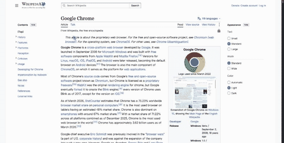

<div align="center">



<p>
  <a href="https://github.com/OrderG-X/dsh-chrome-bridge/releases"></a>
  
  = 116" />
  
  = 18" />
  
</p>

<p>
  <a href="README.md"><b>English</b></a> ·
  <a href="README.zh.md">简体中文</a> ·
  <a href="docs/NOTES.zh.md">Development notes</a>
</p>

</div>

---

**Give your DSH agent hands inside the Chrome you are already using** — your logins, your tabs, your session. Install once, no Connect button, ever.



<sub>Every click flies a cursor to the target and labels what it is doing. It renders *inside the page*, so it lands in screenshots too — you and the model look at the same picture.</sub>

## ✨ Why another browser bridge?

Every existing option makes you click something, every time:

| Option | What goes wrong |
|---|---|
| `chrome-devtools-mcp --autoConnect` | Chrome asks *"Allow remote debugging?"* on **every** connection |
| Browser MCP (store extension) | You must click the extension icon → **Connect** on **every** tab |
| WebSocket-based bridges | Open a TCP port and trust anything that can reach it |
| **dsh-chrome-bridge** | Nothing to click. Nothing listening on a port. |

Three things make the difference:

- 🔌 **Native messaging, not a port.** The extension talks to a local Node host over Chrome's native messaging pipe; the CLI reaches the host through a `0600` Unix socket guarded by a token. No TCP port to scan, no origin to spoof.
- 🎯 **`chrome.debugger`, not injected scripts.** Clicks and keystrokes are dispatched as real CDP `Input.*` events, so they carry a user gesture — popups open, focus works, and sites that reject synthetic events behave normally. Screenshots, network, console and raw CDP come for free.
- 👀 **A cursor the human can see.** Every click flies a small in-page cursor to the target, flashes a ripple and shows a label — and because it is rendered inside the page, **it appears in screenshots**.

## 🏗 Architecture

```
DSH's agent  (provided by the harness — this repo ships none)
  ├── browser_* tools  (DSH plugin)  ─┐
  └── cb CLI           (shell)       ─┤
                                      ▼
                     Unix socket  /tmp/dsh-bridge.sock   (0600 + token)
                                      ▼
                     Node native host  ←─ native messaging (stdio) ─→  Chrome extension (MV3)
                                                                            │ chrome.debugger
                                                                            ▼
                                                                       real CDP
```

**This repo ships no agent** — the agent above is DSH's own; we only give it hands.

The extension ID is fixed by the public key embedded in `extension/manifest.json`, so it is **identical on every machine** and the native-host registration never needs editing.

## 🚀 Install

Requirements: **macOS**, **Google Chrome 116+**, **Node.js 18+**, and `python3` (installer only, to derive the extension ID).

```bash
git clone https://github.com/OrderG-X/dsh-chrome-bridge.git
cd dsh-chrome-bridge
./install.sh
```

Then the one manual step, once in your life:

1. open `chrome://extensions`
2. enable **Developer mode** (top right)
3. **Load unpacked** → pick `~/dsh-bridge-extension`

Verify:

```bash
cb status     # host pid … | extension connected: ✅
cb tabs
```

### 🧩 Optional: native DSH tools

Without this you drive the bridge from a shell (`cb …`). With it, DSH gets **9 native tools**, and screenshots come back as **images the model actually sees**.

Sidebar → **Plugins** → **Add plugin** → paste either of these → Install → Enable → **restart DSH**:

```
/absolute/path/to/dsh-chrome-bridge/plugin          # local checkout (recommended for development)
github:OrderG-X/dsh-chrome-bridge#path:plugin       # straight from GitHub, no clone needed
```

| Tool | What it does |
|---|---|
| `browser_tabs` | list / find / open / close / activate tabs |
| `browser_read` | visible text, HTML, attributes, page info |
| `browser_click` | click by selector, by text, or by coordinates |
| `browser_input` | type, press keys, select, upload, hover, scroll |
| `browser_nav` | navigate and wait for load |
| `browser_screenshot` | screenshot **returned as an image** (viewport / full / element) |
| `browser_eval` | run JS in the page |
| `browser_wait` | wait for an element to appear |
| `browser_dialog` | release alert / confirm / prompt |

> A freshly installed bundle is not hot-loaded; the app must be restarted once.
> `dsh plugin add` from the CLI refuses the app-managed profile — use the GUI.
> Plugin updates are not automatic in DSH yet: to upgrade, uninstall and install again.
> A **local path** install is a `link:`, so a `git pull` is enough there.

## 📖 Usage

### `cb` — from the shell

```bash
cb status / cb version / cb reload      # health, hot-reload the extension after edits

cb tabs                                 # list tabs (* = active)
cb find <keyword>                       # filter by title/URL
cb info   active                        # title, URL, viewport, pending dialog

cb text   active [selector]             # visible text (best first read)
cb html   active [selector]
cb attr   active <selector> <name>
cb wait-for active "<selector>"         # wait until it exists and is visible

cb eval   active "<js>"                 # run JS in the page
cb click-el   active "<selector>"       # real mouse event
cb click-text active "Sign in"
cb click  active <x> <y>
cb type   active "text" --into "<selector>"
cb key    active Enter                  # combos: "meta+a"
cb focus / cb select / cb upload / cb hover / cb scroll
cb dialog active accept                 # release an alert/confirm — otherwise the page hangs

cb nav    active https://example.com
cb shot   active --out /tmp/x.png       # --full whole page, --sel "<selector>" one element
cb console active / cb network active --reload
cb cursor active click 400 300          # drive the cursor by hand
cb cdp    active Page.reload '{}'       # raw CDP escape hatch
```

`active` can be replaced by a tab id. Add `--json` for raw output.
Clicks and typing move the visible cursor by default; pass `--no-cursor` to skip it.

### Management

```bash
dsh-chrome-bridge status      # repo / installed / running version + connection
dsh-chrome-bridge update      # sync code + hot-reload the extension (no Chrome clicking)
dsh-chrome-bridge test        # end-to-end self test
dsh-chrome-bridge logs        # extension log + host log
dsh-chrome-bridge uninstall
```

## 🔒 Security

Be honest about what this is: **the extension can read and control every page you are logged into.**

- The bridge is **local-only**. Native messaging is a private pipe; the CLI socket is `0600` and additionally token-guarded. **No network listener is opened.**
- Chrome shows a permanent *"… is debugging this browser"* banner while attached. That banner is the point — you can always see that it is active.
- Anything that can already run as your user can read your Chrome profile; this does not widen that boundary. It does make it *convenient*, which is worth a thought before leaving an agent unattended.
- **Once the DSH plugin is installed, the model drives your browser without asking.** Plugin tools run inside the DSH host process, so they are *not* gated by the workspace sandbox or the approval prompts that guard `bash`. That is what "native" buys you — and it means an unattended agent holds your browser. Disable the plugin in the sidebar if you want that gate back.
- Detach any time: click **Cancel** on the banner, or `cb detach <tab>`.

## ⚠️ Limitations

- **macOS only** for now — the native-host registration path is macOS-specific; Windows and Linux need their own registration directory.
- **`chrome://` pages are unreachable** — Chrome forbids injection there. Use a normal tab.
- An `alert()` blocks the page: `cb info` warns you, `cb dialog accept` releases it.
- Chrome defers `alert()` in background tabs until the tab is focused.
- Chrome 137+ removed `--load-extension`, so the very first load must go through `chrome://extensions`.
- Distributed **unpacked**, not through the Chrome Web Store — the `debugger` permission is not realistically approvable there.

## 🔎 Related projects

The DSH browser-plugin space is already busy — these are worth a look:

- [dsh-plugin-browser-use](https://github.com/fatmind/dsh-plugin-browser-use) — reuses your logged-in Chrome, exposes `wc3_*` tools
- [dsh-plugin-browser](https://github.com/menotbobbybrown/dsh-plugin-browser) — Playwright-based browser automation plugin
- [dsh-browser-bridge](https://github.com/liyongzheng666/dsh-browser-bridge) — localhost WebSocket bridge with a Firefox extension
- [awesome-dsh-plugin](https://github.com/awesome-dsh-plugin/awesome-dsh-plugin) — the curated catalog of DSH plugins

What is different here: **no listening port** (native messaging), **real CDP input events** via `chrome.debugger`, and an **on-page cursor that shows up in screenshots**.

## 🤝 Contributing

Issues and PRs welcome.

`docs/NOTES.zh.md` is the running log of every pitfall hit while building this — read it before changing the extension or the plugin; it will save you a day. It also documents a way to **verify the plugin without restarting your app** (throwaway profile + headless).

MIT licensed.
